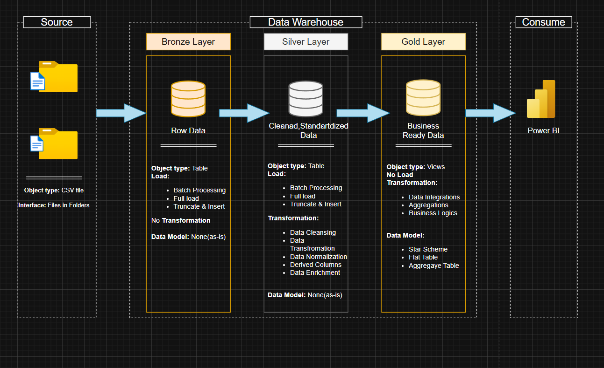
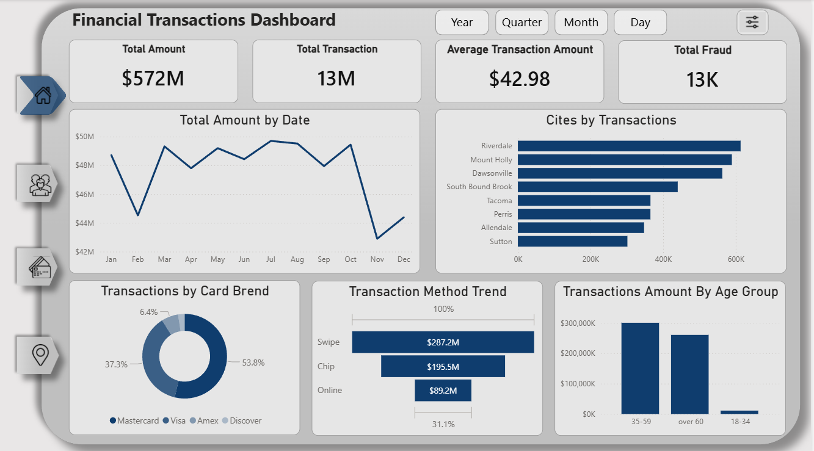
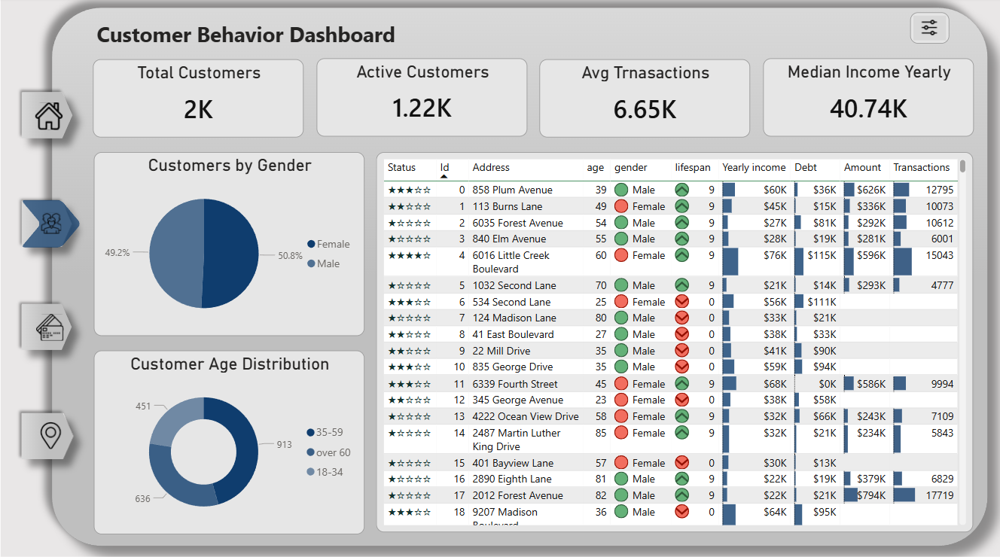
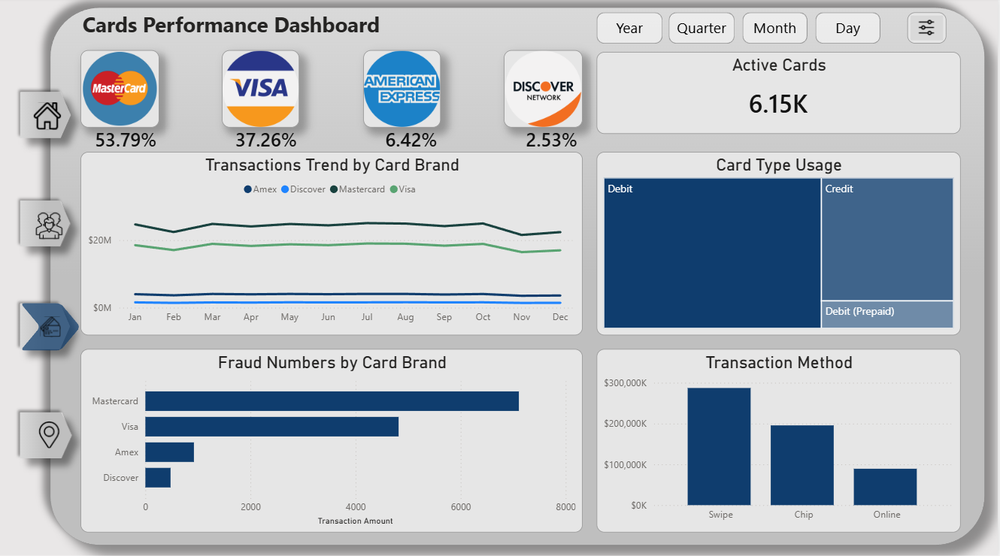
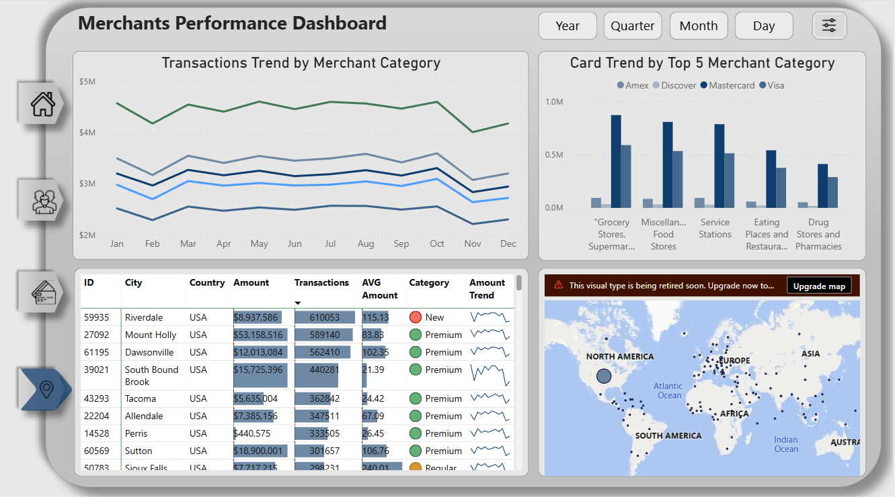

## Financial Transactions Analytics Project (SQL + Power BI)

This project demonstrates an end-to-end data analytics workflow, starting from raw CSV ingestion to interactive business intelligence dashboards.

### Architecture

The data pipeline follows a Medallion Architecture:

- Bronze Layer: Raw CSV data ingestion into MSSQL.
- Silver Layer: Data cleaning, normalization, and transformation using SQL-based ETL processes.
- Gold Layer: Analytics-ready data models optimized for reporting and visualization.

### Workflow

1. Imported financial transaction dataset from CSV.
2. Designed MSSQL data warehouse using Medallion Architecture.
3. Built ETL processes to transform and structure data.
4. Performed Exploratory Data Analysis (EDA) on the Gold layer.
5. Developed Power BI dashboards including:

- Financial Transactions Overview
- Customer Behavior Analysis
- Card Performance Analytics
- Merchants Performance Dashboard
 ## 🔗 Power BI Report

[👉 View Interactive Dashboard](https://app.powerbi.com/view?r=eyJrIjoiM2ZlMjA0NzktMzdhZC00MmU1LTlhODMtYTk1MjVhYjA5YzFmIiwidCI6ImM5NDI0M2ViLTZmMGUtNDU2Ni1hMjk2LWI1ZGZjOWQyNTczYiIsImMiOjh9) 

### Tools & Technologies

- MSSQL
- SQL (ETL & data modeling)
- Power BI
- Data Warehousing (Medallion Architecture)
- Data Visualization

### Key Insights

- Transaction trends over time
- Customer demographic behavior
- Card usage performance
- Fraud analysis metrics

### 1. Global Transactions Dashboard

### 2. Customer Behavior Dashboard

### 3. Cards Performance Dashboard

### 4. Merchants Performance Dashboard

